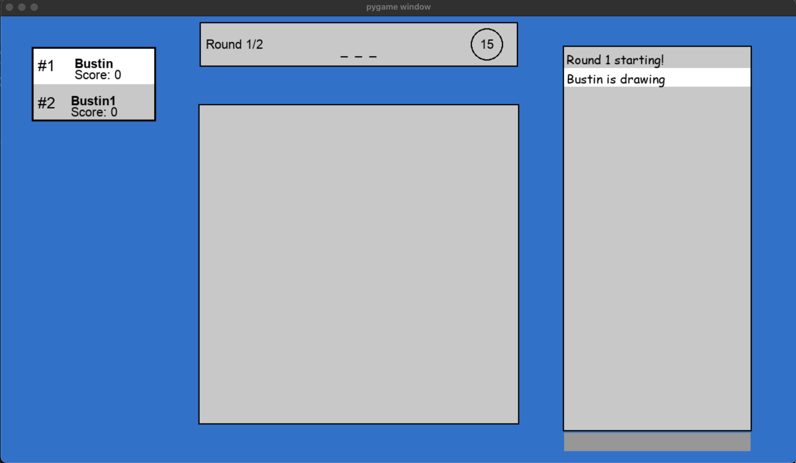
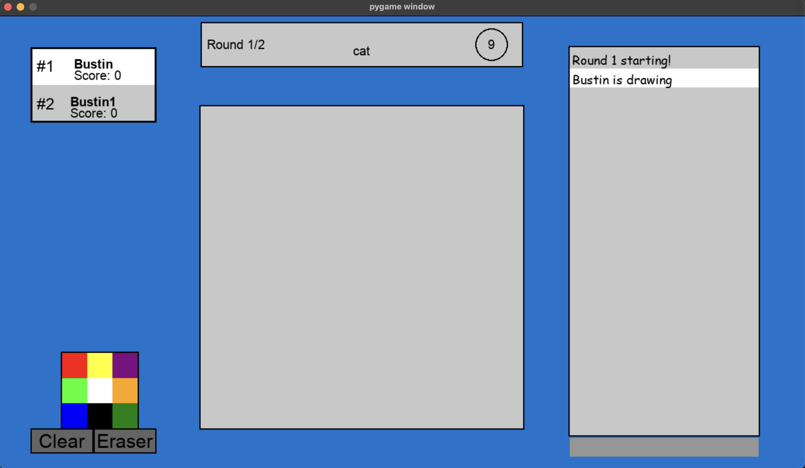

# my-pictionary
A boot-legged version of [https://skribbl.io/](https://skribbl.io/). Supports multiple players. Uses a client-server model.

## Requirements
```
sudo apt-get install python3
sudo apt-get install pip
python3 -m venv venv
source venv/bin/activate
pip install pygame
```

## How to use
### Localhost
You're going to need to change the IP address in the `client.py` and `server.py` files to `127.0.0.1`.
`scp -r client server root@ip_address`

### Linode
1. Create an account and launch an instance.
2. Remember the IP address and share it with your friends.
3. Then scp the server folder over, and you can run the client from anywhere.
4. Install requirements

`python server.py` to run
`python client.py` to play

# Highlights and Design
- Supports clear functions and multiple color functions.
- Real-time rendering, no lag.
- Uses a client-server model to authenticate users.
- Techniques to reduce payload size.
- Barrier to ensure the safety of thread order.
- Game class is like the manager. server and client are the messangers and receiving. And the rest of the classes are extensions like arms of the game class. (OOP)
- some testing in `test_server.py`
- chatbox

# Improvements
- Better UI for loading in the queue.
- More animations between starting and ending rounds.
- Score system is basic.
- Add a timeout so players don't wait too long in the queue
- Add command ling options like initial time, and min number of players to play
- Handle disconnections gracefully
- And way too many to count.

# Client (guessing)


# Client (drawing)


